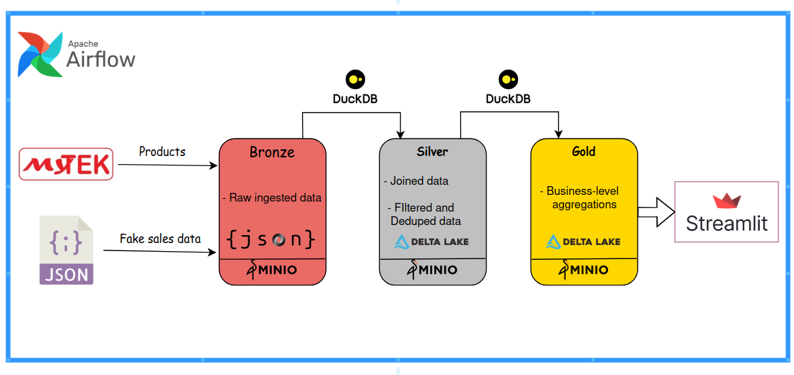
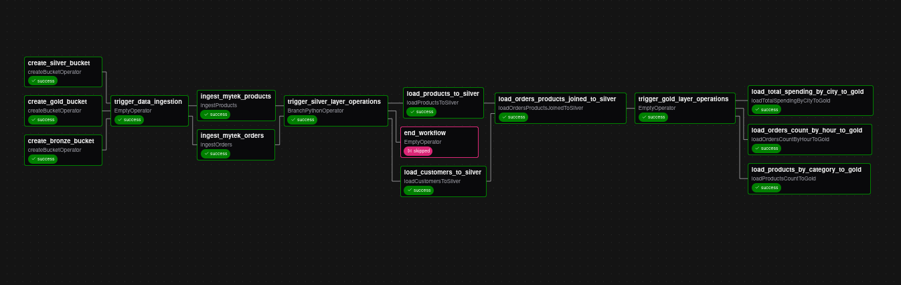

# 🛒 Mytek Sales Pipeline

This project implements an **end-to-end modern data pipeline** for processing and analyzing **Mytek sales data** (I used random generated data since I do not have access to the company's data).  
It follows the **Medallion Architecture (Bronze → Silver → Gold)** using **Delta Lake**, **DuckDB**, and **Airflow on Astronomer (Astro)**, with a final **Streamlit Dashboard** for visualization.

---

## ✨ Pipeline Overview

- **Bronze** → Ingest raw sales data into Delta Lake on MinIO (S3)  
- **Silver** → Clean and standardize data with DuckDB SQL transformations  
- **Gold** → Create business-ready marts for analytics and reporting  
- **Airflow (Astro)** → Orchestrates the pipeline (DAGs)  
- **Streamlit** → Interactive BI dashboard for business insights  

---

## ⚙️ Tech Stack

- **Apache Airflow (Astronomer)** → orchestration & scheduling  
- **DuckDB** → query engine & in-process analytics  
- **Delta Lake** → ACID-compliant storage format  
- **MinIO / S3** → object storage  
- **Python** → DAGs, transformations, Streamlit app  
- **Docker & docker-compose** → containerized setup  
- **Streamlit** → final interactive dashboard  
- **Pytest** → DAG & transformation tests  

---

## Airflow DAG

